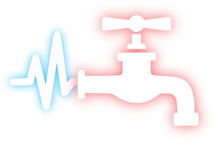

# Beat Piper

 

 

# Motivation

I got into Beat Saber but haven't found a good way to automatically find beatmaps for songs I know. There are some similar projects, but they are either paid or I haven't had a good experience with them.

# Contributing

For information on how to set up this project see [`CONTRIBUTING.md`](CONTRIBUTING.md)

# Attributions

I got the name from a [reddit post](https://www.reddit.com/r/beatsaber/comments/hneox9/comment/fxbynuq) from [@PapuaNewGuinean](https://www.reddit.com/user/PapuaNewGuinean). I hope that's okay
